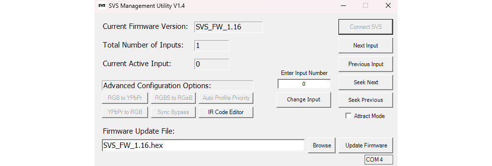

<h1 align="center" style="margin-top: 0px;">SVS Control Module Firmware BETA Versions</h1>

### Warning! These are BETA firmwares. You may experience unexpected results. You can revert to STABLE firmware versions at any time.

### [For STABLE firmware versions click here](index.md)

<h2 align="center" style="margin-top: 0px;">Update Instructions</h2>

### Windows Users
**SVS Management Utility**

*Based on the foundation created by [KnightNZ](https://github.com/KnightNZ) in the SVS_Flash program I have expanded it into a more comprehensive firmware update and management utility. The SVS Management Utility allows you to connect to your SVS, check current firmware version, install new firmware updates, and manually control the SVS. In future releases the SVS Management Utility will also allow you to configure advanced settings on the SVS in bulk using your computer instead of manually toggling those settings with your SVS IR remote.*

**SVS Management Utility 1.4 adds auto update capability. It can automatically download the latest firmware as well as check for updates to the management utility scripts. This version of the management utility is no longer packaged as a .exe file due to antivirus false positives that were caused by the compilation tools I was previously using to compile the script as an exe. The utility is now distributed as a powershell script with a .bat file used to launch the script.**

**[Download the latest SVS Management Utility](https://cdn.shopify.com/s/files/1/0903/4271/9805/files/SVS_Management_Utility.zip?v=1777911837)**

**SVS Management Utility Instructions**

1. Download the latest Firmware Update file and unzip it somewhere on your computer.
2. Run the .bat file labeled "SVS Management Utility.bat" 
3. The SVS Management Utility will search the firmware update repository and find the latest firmware file and download it for you. If you want to install a different firmware version than the latest stable firmware you can use the "Browse" button to look for a different firmware file on your PC.
4. Click the "Connect SVS" Button. The SVS Management Utility will search for the correct COM port for updating your SVS. The SVS uses a CH340 serial chip, so the firmware update tool searches for any CH340 devices and selects the first one it finds. If you have multiple CH340 devices connected at once you can click "No" and you will can manually enter the correct COM port for your SVS.
5. Once the SVS Management Utility connects to your SVS you will see the current firmware version that is installed on your SVS, the total number of inputs connected to your SVS, and the current active input of your SVS.
6. To update your firmware, simply click the "Firmware Update" button and the SVS Management Utility will flash the new firmware file and alert you when the flash is complete. It will update the current firmware version to reflect the newly installed firmware on your SVS.

In addition to firmware updates you can also use the SVS Management Utility to control your SVS. 

* **Next Input, Previous Input:** These buttons allow you to manually cycle the input selection up or down by one input on your SVS. *Requires minimum SVS Firmware Version 1.12*
* **Change Input:** This button allows you to manually change to the input number specified in the "Enter Input Number" text box. *Requires minimum SVS Firmware Version 1.12*
* **Seek Next, Seek Previous:** These buttons allow you to manually seek to the next or previous active input if you have multiple video sources active at the same time. This function skips all inactive inputs. *Requires minimum SVS Firmware Version 1.14*
* **Attract Mode:** This checkbox allows you to turn "Attract Mode" on or off. *Requires minimum SVS Firmware Version 1.14*
* **Advanced Configuration:** This set of features is still under development, but will allow the user to make bulk changes to settings such as which inputs should activate the RGB to YPbPr and YPbPr to RGB Transcoder modules. More info to come.

**_If you are still running Windows 10 you can also use the SVS Management Utility, but the original "SVS Firmware Update Tool v1.0 Windows.bat" file is still included if for whatever reason you would rather use that. The batch file no longer works on Windows 11 with the full deprecation of wmic so the SVS Management Utility is the only option to update on Windows 11._**

### Unix Users

 Thanks to the fantastic work of [Thiaramus](https://github.com/thiaramus), the firmware update script has been ported to Unix based systems such as Linux and MacOS.

#### Linux Users

* Install AVRDUDE using your package manager:

Open a terminal and run the following command to install AVRDUDE:
`sudo apt-get install avrdude`

_For your specific Linux distribution, you may need to use a different package manager or command to install AVRDUDE.
The example above is for Ubuntu and Debian based distributions._

* Run in the terminal:
`bash SVS\ Firmware\ Update\ Tool\ v1.0\ Unix.sh`

#### Mac Users

1. Follow the instruction at [https://brew.sh](https://brew.sh) to install Brew.

2. Install AVRDUDE using Brew:
`brew install avrdude`

3. Run in the terminal:
`bash SVS\ Firmware\ Update\ Tool\ v1.0\ Unix.sh`

<h2 align="center" style="margin-top: 0px;">Firmware Update Downloads</h2>

## Version 1.20 Beta (2026-05-09)

### [Download](https://github.com/Arthrimus/SVS_Firmware_Repository/releases/download/v1.20_BETA/SVS_Firmware_1.20_BETA.7z)

### Changelog:
- Fixed auto switch deselect bug. Firmware 1.16 introduced a bug which prevented auto switching back to a previous active input when more than one input is active under specific conditions. 
- Complete rewrite of the serial parser. Completely eliminated the use of strings in exchange for fixed char buffers. Achieves safer memory management and crash resistance in the event of a serial buffer overflow.
- Added HDMI parallel mode for HDMI modules. HDMI modules can change active input without affecting analog inputs. Dual simultaneous output through both HDMI and Analog now possible.
- Added a user controllable toggle for HDMI parallel mode. HDMI modules can operate independently as a second input channel, or they can operate as normal input modules on the same channel as the analog inputs.
- Added manual HDMI parallel control through remote and pushbutton. Allows user to switch between manual control for analog inputs or HDMI inputs on the fly.
- Added user controllable toggle between HDMI inputs and Analog inputs to select which video channel is controlled by attract mode.
- Added HDMI module identification to the boot process of the control module so the control module can automatically identify and assign HDMI inputs to the second video channel for parallel mode.
- Added per input auto profile deprioritization option. This is ideal for users that have HDMI modded systems, where they are connecting both analog and digital inputs to the SVS simultaneously. This setting allows the user to select which input (analog or digital) is prioritized for auto profile loading when the console is powered on. This feature also applies to the IR blaster function.
- Added control system for controlling sync on green conversion and sync bypass options on V3 SCART and V3 VGA Input Modules.
- Added IR remote commands for controlling sync on green conversion and sync bypass options on V3 SCART and V3 VGA Input Modules. 
- Added extra functions to the peripheral communication system for YPbPr to RGB and RGB to YPbPr transcoder modules to enable two way communication for advanced configuration.
- Added a routine to the serial SVS_Change_Input_"#" command to correctly identify HDMI parallel mode and switch only the video channel that corresponds to the requested input number, leaving any active input on the other channel untouched.
- Added Serial commands for all new toggleable features added in this firmware.
- Optimized input auto deselection routine to save flash memory space and execute in fewer cycles.
- Optimized many functions throughout the firmware to save flash and memory resources. 
- Adjusted IR remote receiver timing to reduce occasional errant double presses when a button on the IR remote is held for too long. (The SVS IR remote does not send a proper repeat flag when a button is held so repeat detection timing has to be manually tuned)

## Version 1.14 Beta (2025-03-09)

### [Download](https://github.com/Arthrimus/SVS_Firmware_Repository/releases/download/v1.14_BETA/SVS_Firmware_1.14_BETA.7z)

### Changelog:
- Added an interrupt to the control module pushbutton to cancel SD card reading and IR code transmission to speed up manual input cycling during IR code transmission sequence.
- Added a quasi-interrupt like function to the IR receiver to cancel IR code transmission, but not SD reading, to speed up manual input cycling during IR code transmission sequence. (true interrupt not feasible at this time)
- Added user defined IR code transmission delay time for SD card IR code files. (Was present in older firmware, but was temporarily removed (accidentally) in 1.13 as part of the SD card loading system rewrite)
- Added Power on/off option using the SVS IR remote and serial commands. _Use the Power Button on the SVS remote_
- Added "attract mode" option to automatically cycle through inputs at timed intervals. (Just for fun!)  _Use the "Mute" button on the IR remote to toggle this on or off._
- Optimized serial parser to significantly reduce memory usage. (We're running out of RAM!)
- Updated peripheral communication system's command set to reduce memory usage. (No really, we're running out of RAM.)
- Converted all 2 state variables from integer (we used to have it so easy) to Boolean to reduce memory usage.(We're pretty desperate for RAM at this point.)

## Version 1.11 Beta (2025-02-17)

### [Download](https://github.com/Arthrimus/SVS_Firmware_Repository/releases/download/v1.11_BETA/SVS_Firmware_1.11_BETA.zip)

### Changelog:
- Added 500ms delay to new input detection. This helps eliminate phantom input detection caused by occasional transient voltage spikes inside the switch.

 
